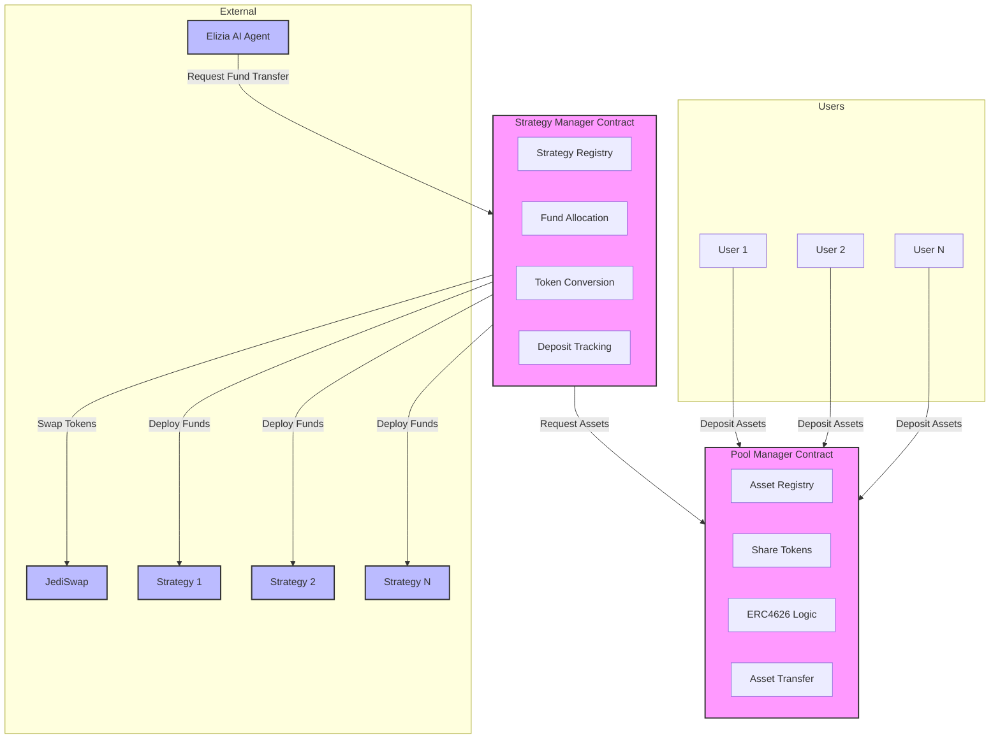
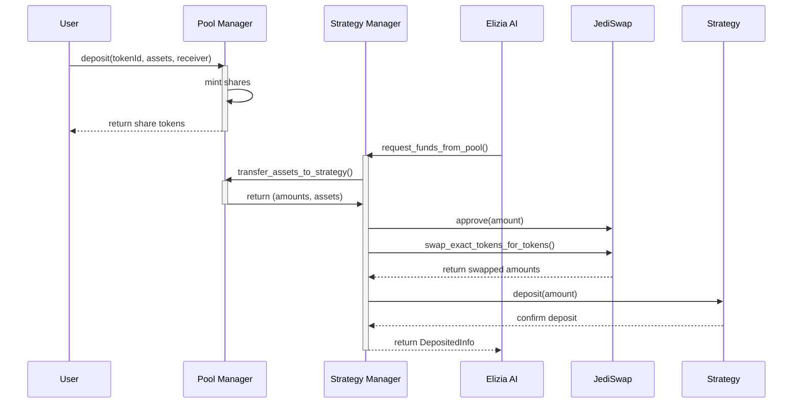

# DeFi Protocol Technical Documentation

## Overview
This document outlines the technical architecture and implementation of DeFi protocol built for the Starknet blockchain. The protocol consists of two main components:
1. Pool Manager (ERC6909-compatible Vault)
2. Strategy Manager (Automated Investment Controller)

The protocol leverages AI-driven strategy selection through the Elizia AI agent to optimize yields across various DeFi strategies.

## Core Components

### 1. Pool Manager Contract
The Pool Manager implements both ERC6909 (Multi-Token Standard) and ERC4626 (Tokenized Vault Standard) specifications, providing a flexible and standardized vault system for multiple assets.

#### Key Features:
- Multi-asset support (ETH, USDT, USDC, etc.)
- ERC4626-compliant deposit/withdrawal mechanisms
- Asset registration system
- Share token minting/burning
- Access control and security measures

#### Core Functions:
- `deposit(tokenId, assets, receiver)`: Deposits assets and mints shares
- `withdraw(tokenId, assets, receiver, owner)`: Burns shares and returns assets
- `mint(tokenId, shares, receiver)`: Mints exact shares by depositing assets
- `redeem(tokenId, shares, receiver, owner)`: Redeems exact shares for assets
- `register_asset(vault_asset, name, symbol)`: Registers new assets in the vault
- `transfer_assets_to_strategy(requested_address)`: Transfers assets to strategies

### 2. Strategy Manager Contract
The Strategy Manager coordinates with the Elizia AI agent to optimize yield generation across different DeFi strategies.

#### Key Features:
- Strategy registration and management
- AI-driven fund allocation
- Asset conversion and routing
- JediSwap integration for token swaps
- Deposit tracking and history

## System Architecture

### Asset Flow
1. Users deposit assets into the Pool Manager
2. Pool Manager maintains asset registries and share tokens
3. Elizia AI agent triggers Strategy Manager
4. Strategy Manager:
   - Requests funds from Pool Manager
   - Converts assets to target token
   - Distributes to selected strategies

### Token Conversion Process
1. Assets are gathered from Pool Manager
2. JediSwap router converts tokens to target asset
3. Consolidated funds are sent to selected strategy

## System Flow Diagram

## Sequence Diagram

## Security Features

### Pool Manager
- Reentrancy protection
- Pausable functionality
- Upgradeable design
- Access control for admin functions
- Share token allowance system

### Strategy Manager
- Elizia-only access for fund requests
- Owner-restricted strategy management
- Reentrancy guards
- Deposit tracking and verification
- Slippage protection in swaps

## Integration Points

### External Protocols
- JediSwap: Used for token swaps and liquidity
- Elizia AI: Strategy selection and timing
- DeFi Strategies: Yield generation endpoints

### Internal Interfaces
- Pool Manager <-> Strategy Manager communication
- Strategy execution through dynamic selectors
- Event emission for tracking and monitoring
